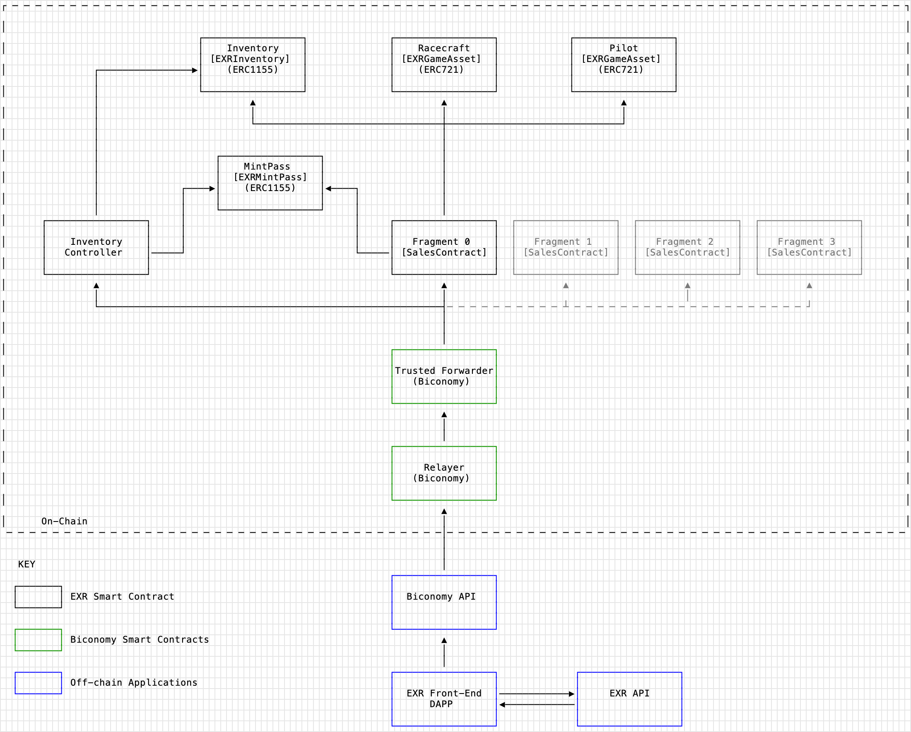
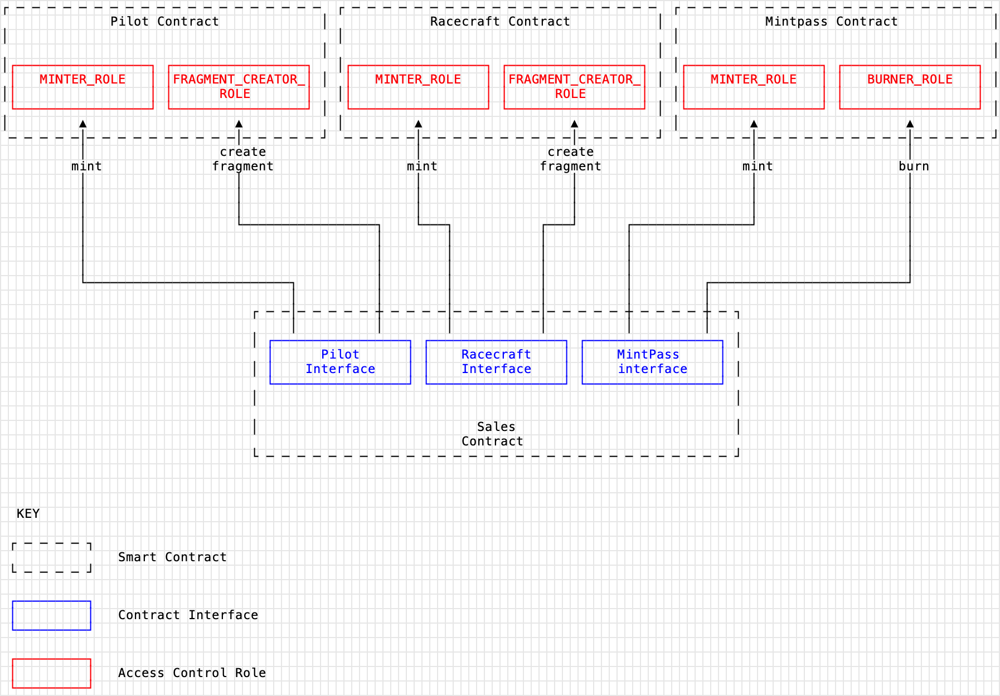
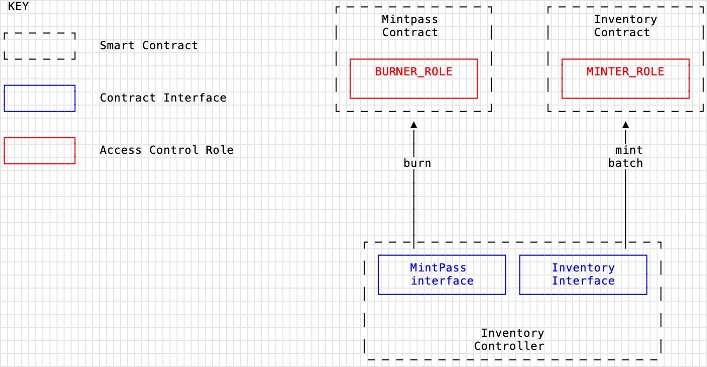

# Exiled Racers Smart Contract Ecosystem

## Table Of Contents

1.  [Project Overview](#project-overview)
1.  [Core Architecture](#core-architecture)
1.  [Considerations](#considerations)
1.  [Contracts]()
    1.  [EXRGameAssetERC721](##EXRGameAssetERC721)
    1.  [EXRInventoryERC1155](##EXRInventoryERC1155)
    1.  [EXRMintPassERC1155](##EXRMintPassERC1155)
    1.  [EXRInventoryController](##EXRInventoryController)
    1.  [EXRSalesContract](##EXRSalesContract)
1.  [Extensions](#extensions)
    1.  [CouponSystem](#couponsystem)
    1.  [ERC721Fragmentable](#erc721fragmentable)
1.  [Contract Interactions](#contract-interactions)
    1. [Contract-Contract Interactions](#contract-contract-interactions)
       1. [Sales Contract](#sales-contract)
       1. [Inventory Controller](#inventory-controller)
    1. [User Contract Interactions](#user-contract-interactions)
1.  [Gassless Transactions](#gasless-transactions)

# Project Overview

Exiled Racers (EXR) is an online multiplayer race management game that utilises NFTs as in-game assets. The project is built on top of the Moonbeam network - an EVM-compatible Polkadot parachain. The NFTs serve as in-game items, required for participation in the gaming ecosystem, but can stand alone as collectibles. At present, there are three asset classes (ie. three NFT collections) used in the game. An additional asset class, Mintpasses, are issued to users and then exchanged for game assets.

- Pilots
- Racecraft
- Inventory Items
- Mintpasses

The smart contracts in this repository support the creation and management of these NFT collections. At the time of launch, the game will have no on-chain game mechanics, but this topic will be further explored in later sections of the documentation. The smart contract architecture supports a phased approach to the project’s launch. This phased approach has two components: the first defines the separate release of each collection (asset class), and the second describes the "collections-within-a-collection" approach of the `ERC721Fragmentable` extension design that allows the Pilot and Racecraft collections each to be separated into smaller sub-collections that can be released independently of one another on the same contract. This will allow each collection to be released in stages, introducing more assets into the ecosystem over time as it grows.

Because each asset class is capable of standing alone as its own NFT collection, each will have its own launch event during the project's release. The beta version of the game will only be launched once all asset classes have been released and the tokens have been acquired by users.

The project ecosystem will make use of Biconomy's relayer protocol to enable gasless transactions for end-users, thus greatly reducing friction for onboarding and gameplay.

# Core Architecture

The diagram below depicts a high-level overview of the EXR Smart Contract ecosystem. An in-depth overview of each contract can be found in the [Contracts](#contracts) section.



The architecture's design is predicated on the design of the `ERC721Fragmentable` extension, which is explored in detail in the [Extensions](#extensions) section of this readme. The extension allows a single ERC721 collection to be split into sub-collections (known as Fragments) which can be released independently of one another, while remaining part of the same overarching collection on the same contract.

The release of each Fragment is managed via its own dedicated Sales contract. Within the EXR ecosystem, Pilots and Racecraft have a 1-1 relationship, meaning for every Pilot token there is an accompanying Racecraft token. For this reason, Fragments of the Pilot collection and the Racecraft collection will always be the same size (ie. contain the same number of tokens). The creation of fragments, by an EOA with admin privileges, is managed via the Sales contract, where each deployment of a Sales contract bears the responsibility for a single Fragment.

When a new Fragment is released, a new Sales Contract is deployed and assigned to the new fragment. Once the new Fragment is connected to existing token contracts (Pilot, Racecraft, Inventory, Mintpass) via contract interfaces, the previous Sales Contract becomes obsolete.

Unlike the Pilot and Racecraft contracts, which are both `ERC721`, the Inventory Items contract adheres to the ERC1155 spec. Inventory items play a different role within the ecosystem and for that reason do not need to follow the Fragmentable design pattern. The release of Inventory Items is managed by the `Inventory Controller`, which does not need to be replaced, unless additional logic is required.

# Considerations

There were several factors influencing the design of the smart contract architecture, as well as the the functionality and code for each contract. These included:

- Gas fees on the Moonbeam Network
- Random Number Generation
- The Project's launch strategy and how this influenced the design of the contracts
- The use of on-chain game mechanics

For a complete overview of these factors, please review the [docs/considerations.md](./docs/considerations.md) section of the documentation.

# Contracts

## EXRGameAssetERC721

Inherits from:

- `ERC721Fragmentable`
  - `ERC721Enumerable`
  - `Ownable`
  - `AccessControl`
- `Pausable`

The Game Asset contract represents a collection of unique `ERC721` game assets, such as the Pilots and Racecraft. It inherits from the `ERC721Fragmentable` extension, which itself inherits from OpenZeppelin's `Ownable` and `AccessControl`, as well as `Pausable`. `ERC721Fragmentable`'s functionality will be covered in the [Extensions](#extensions) section that follows.

The Game Asset contract's primary business logic revolves around the minting of tokens. Because users do not mint directly from the contract, minting is controlled via `Access Control`, where only the `Sales Contract` is granted the `MINTER_ROLE`.

For every token that's minted, the ID needs to be associated with the Fragment to which it belongs.

```js
mapping(uint256 => uint256) public idToFragments;
```

The primary purpose of the struct is to keep track of which Fragment the token belongs to, as the `tokenURI` returns metadata specific to the Fragment to which the token ID belongs.

```js
function tokenURI(uint256 tokenId) public view virtual override returns (string memory) {
    if (!_exists(tokenId)) revert GameAssetTokenDoesNotExist({tokenId: tokenId});

    uint256 fragment = idToFragments[tokenId];

    return _fragmentTokenURI(fragment, tokenId);
}
```

All `EXRGameAssetERC721` contracts have the following minimum interface:

```
interface IEXRGameAsset {
    function mint(
        address recipient,
        uint256 count,
        uint8 fragment,
        bytes32 seed
    ) external;

    // Inherited from ERC721Fragmentable
    function createFragment(
        uint8 id,
        uint64 fragmentSupply,
        uint64 firstId,
        uint64 reserved
    ) external;

    function fragmentExists(uint256 fragmentNumber) external view returns (bool);
}
```

## EXRInventoryERC1155

Inherits from:

- `ERC1155`
- `AccessControl`
- `ERC1155Burnable`
- `ERC1155Supply`
- `Ownable`

Inventory Items represent generic utility items within the EXR ecosystem and thus follows the `ERC1155` standard for fungible tokens. The contract's main business logic handles minting of tokens and managing `URIs` for each token. Token URIs are stored in a `mapping` that associates a URI to a particular token ID:

```
mapping(uint256 => string) _itemURIs;
```

If a particular token URI has not been set, and a token has been minted, the contract will return a `fallbackURI` shared by all tokens that have not had a URI set.

```js
function uri(uint256 id) public view override returns (string memory) {
    if (!exists(id)) revert InventoryNonExistentToken();
    return bytes(_itemURIs[id]).length > 0 ? _itemURIs[id] : fallbackURI;
}
```

Users do not mint directly from the contract. Instead all minting takes place via the `EXRInventoryController` contract which is assigned the `MINTER_ROLE`.

The `EXRInventoryERC1155` contract has the following minimum interface:

```
interface IEXRInventory {
    function mintBatch(
        address to,
        uint256[] memory ids,
        uint256[] memory amounts,
        bytes memory data
    ) external;
}
```

## EXRMintPassERC1155

Inherits from:

- `ERC1155Burnable`
- `ERC1155Supply`
- `Ownable`
- `AccessControl`

Mintpass tokens are issued to users who are whitelisted to participate in EXR's launch event. Mintpass Tokens are semi-fungible and thus adhere to the `ERC1155` spec. The contract utilizes OpenZeppelin's `AccessControl` library to restrict minting and burning of tokens to contract addresses that have been assigned the `MINTER_ROLE` and `BURNER_ROLE` respectively. There are three types of Mintpass tokens that are utilized, defined by the following constants:

```
uint256 constant pilotPassTokenId = 1;
uint256 constant racecraftPassTokenId = 2;
uint256 constant inventoryTokenId = 3;
```

In order to accurately keep track of the number of token mints, which the Sales Contract uses when determining eligibility to mint, the `EXRMintPassERC1155` contract needs to be aware of which fragment the token was minted for. This is done using a nested `mapping`.

```js
mapping(uint256 => mapping(uint256 => uint256)) public tokenMintCountsByFragment;
```

When a token is minted by the sales contract, the Fragment for which it is being minted is passed in as a parameter. The `burnToRedeemPilot` is called by the Sales Contract when a user is exchanging their Pilot Mintpass token for a Pilot `ERC721` token.

```js
function burnToRedeemPilot(address account, uint256 fragment) external onlyRole(BURNER_ROLE) {
    tokenBurnCounts[pilotPassTokenId]++;
    tokenMintCountsByFragment[fragment][racecraftPassTokenId]++;
    tokenMintCountsByFragment[fragment][inventoryTokenId]++;

    _burn(account, pilotPassTokenId, 1);
    emit PassBurned(account, pilotPassTokenId);

    _mint(account, racecraftPassTokenId, 1, "");
    emit PassMinted(account, racecraftPassTokenId, 1);

    _mint(account, inventoryTokenId, 1, "");
    emit PassMinted(account, inventoryTokenId, 1);
    emit PilotRedeemed(msg.sender);
}
```

It's necessary to keep track of the mint counts this way as the `totalSupply()` function provided by the `ERC1155Supply` extension takes into account tokens that have been burnt, so it does not provide an accurate representation of total number minted, but rather the current available supply.

the `EXRMintPassERC115` has the following minimum interface:

```
interface IEXRMintPass {
    function balanceOf(address account, uint256 id) external view returns (uint256);

    function totalSupply(uint256 id) external view returns (uint256);

    function mint(
        address recipient,
        uint256 qty,
        uint256 tokenId,
        uint256 fragment
    ) external;

    function burnToRedeemPilot(address account, uint256 fragment) external;

    function authorizedBurn(address account, uint256 tokenId) external;

    function tokenMintCountsByFragment(uint256 fragment, uint256 tokenId)
        external
        view
        returns (uint256);

    function addressToPilotPassClaimsByFragment(uint256 fragment, address caller)
        external
        view
        returns (uint256);

    function incrementPilotPassClaimCount(
        address caller,
        uint256 fragment,
        uint256 qty
    ) external;
}
```

## EXRInventoryController

Inherits from:

- `ERC2771Context`
- `AccessControl`
- `Pausable`
- `ReenctranctGuard`
- `CouponSystem`

The business logic in the `EXRInventoryController` is responsible for allowing a user to exchange an Inventory Mintpass for a predetermined number of Inventory Items. The Inventory Controller contract has the following features:

- Users burn an Inventory Mintpass in exchange for random Inventory Item mints
- Users claim reward items
- An Admin user can set the Mintpass contract interface
- An Admin user can set the Inventory contract interface
- An Admin user can add a category
- Anyone can retrieve a category
- An Admin user can remove a category
- An Admin user can pause/unpause the contract

The ecosystem utilizes 10 different types of Inventory Items, thought the system is dynamic and can accommodate more or less than this. Inventory Items are distributed randomly using a pseudo-random number generated with the help of a secure `seed` created off-chain. Unlike the other contracts, users are able to call `burnToRedeemInventoryItems` directly, provided they have a valid coupon that verifies the `seed` and the `qty` the user is allowed to claim. Users first call `burnToRedeemInventoryItems`, which verifies authenticity of the `Coupon` containing the `seed`, `qty` and `CouponType` enum.

```
function burnToRedeemInventoryItems(
    bytes32 seed,
    uint256 qty,
    Coupon calldata coupon
) external whenNotPaused nonReentrant {
    if (mintpassContract.balanceOf(_msgSender(), inventoryPassId) == 0)
        revert InventoryInsufficientPassBalance();
    if (usedSeeds[seed]) revert InventoryReusedSeed();

    usedSeeds[seed] = true;
    bytes32 digest = keccak256(
        abi.encode(address(this), block.chainid, CouponType.Inventory, qty, seed, _msgSender())
    );
    if (!_verifyCoupon(digest, coupon)) revert InventoryInvalidCoupon();

    mintpassContract.authorizedBurn(_msgSender(), inventoryPassId);
    _claimRandomItems(seed, qty);
}
```

Before diving into the `_claimRandomItems()` function, it's important to define how items are structured. Each Inventory Item has 9 variations, each of which is its own token ID. The data-structure encompassing these 9 token IDs is called a `Category`.

```
struct Category {
    uint8 exists;
    uint8 id;
    uint8[9] tokenIds;
}
```

Categories themselves are all considered equal. In other words, a caller has an equal chance of minting items from any given category. The system is dynamic, and allows an Admin user to add and remove Categories from the contract, which are stored in a dynamic array:

```
Category[] public categories;
```

The `_claimRandomItems()` function is responsible for picking a catefory between `0` and `categories.length`, each of which has an equal weighting. A random number is derived by taking the modulus of the `keccak` hash and `categories.length`, ensuring that the random number is always between 0 and the number of categories in the array.

```
    uint256 randomCategorySelector = (uint256(
        keccak256(abi.encode(seed, blockhash(block.number - 1), block.basefee, i))
    ) % (categories.length * 100)) + 1;

    uint256 id;
    for (uint256 ii; ii < categories.length; ii++) {
        if (randomCategorySelector < (ii + 1) * 100) {
            console.log("category: ", ii);
            id = _selectIdByRarity(randomCategorySelector, ii);
            break;
        }
    }
```

A simple `for loop` allows each category to receive an equal weighting. Once a category is identified, the `_selectIdByRarity()` function returns one of the `9` tokenIds designated in the `Category`. Each `Category` has three tiers of rarity, each with 3 token IDs apiece:

`Tier 0 (common)`: `tokenIds[0]`, `tokenIds[1]`, `tokenIds[2]`
`Tier 1 (mid)`: `tokenIds[3]`, `tokenIds[4]`, `tokenIds[5]`
`Tier 2 (rare)`: `tokenIds[6]`, `tokenIds[7]`, `tokenIds[8]`

The caller has a `50%` chance of minting a `common` item, a `35%` chance of minting a mid-tier item, and a `15%` chance of minting a rare item.

```
   function _selectIdByRarity(uint256 seed, uint256 category) internal view returns (uint256) {
        uint256 randomIdSelector = (uint256(keccak256(abi.encode(seed, category))) % 3000) + 1;
        uint8[9] memory options = categories[category].tokenIds;

        if (randomIdSelector > 2500) {
            return options[0]; // common ( 2500 - 3000)
        } else if (randomIdSelector > 2000) {
            return options[1]; // common (2000 - 2500)
        } else if (randomIdSelector > 1500) {
            return options[2]; // common ( 1500 - 2000)
        } else if (randomIdSelector > 1150) {
            return options[3]; // mid (1150 - 1500)
        } else if (randomIdSelector > 800) {
            return options[4]; // mid (800 - 1150)
        } else if (randomIdSelector > 450) {
            return options[5]; // mid ( 450 - 800)
        } else if (randomIdSelector > 300) {
            return options[6]; // rare ( 300 - 450 )
        } else if (randomIdSelector > 150) {
            return options[7]; // rare ( 150 - 300)
        } else {
            return options[8]; // rare ( 0 - 150)
        }
    }
```

The `EXRInventoryController` Contract does not require an interface. The contract implements `ERC2771Context` to allow for gas-fee-less transactions using Biconomy's relayer protocol.

## EXRSalesContract

Inherits from:

- `ERC2771Context`
- `CouponSystem`
- `ReentrancyGuard`
- `AccessControl`

The Sales contract contains most of the logic required for users interacting with the system, as well as business logic for Admin users to manage the game asset contracts. It covers:

- Users claiming a Pilot Mintpass
- Users exchanging a Pilot Mintpass for a Pilot Token, Racecraft Mintpass, and Inventory Items Mintpass
- Users exchanging a Racecraft Mintpass for a Racecraft Token
- Admin user airdropping Mintpasses
- Admin user creating Fragments for the Pilot and Racecraft GameAsset contracts
- Admin user withdrawing funds from the sale of Pilot Mintpasses
- Admin user setting the state of the claims/redemptions
- Admin user creating interfaces and setting appropriate roles for external contract addresses

The Sales Contract enables gasless transactions via Biconomy's Relayer Protocol by inheriting `ERC2771Context` and overriding `Context`'s `_msgSender()` and using it in place of `msg.sender` for user-facing `external` functions.

```
    function _msgSender()
        internal
        view
        virtual
        override(ERC2771Context, Context)
        returns (address)
    {
        return ERC2771Context._msgSender();
    }
```

The `EXRSalesContract` contract does not require an interface.

# Extensions

## CouponSystem

The CouponSystem extension is a utility contract that allows the inheriting contract to verify a coupon, passed in as function parameters, using `ecrecover`.

The Fragmentable extension enables the following functionality in inheriting contracts:

- Contract deployer setting the admin signer address
- Verifying the validity of a coupon by comparing the recovered address to the admin signer address

The signer address, which is the public key portion of the keypair whose private key signs the coupon, is set in the contract's constructor during deployment.

```js
address internal immutable _adminSigner;

constructor(address signer) {
    _adminSigner = signer;
}
```

The contract also defines the `CouponType` enum, which allows the use for which the Coupon is intended to be encoded in the data, ensuring that a Coupon cannot be used for any purpose other than that which it is intended for.

```
enum CouponType {
    MintPass,
    RandomSeed,
    Inventory,
    Reward
}
```

The Coupons have the following uses:

- `MintPass`: Claiming a Pilot Mintpass in the Sales Contract
- `RandomSeed`: Claiming a token where randomness is required for assigning a token ID
- `Inventory`: Claiming an Inventory Item
- `Reward`: Claiming an Inventory Item as a reward

The `Coupon` struct provided defines a data-structure for the decoded `v`, `r`, and `s` values.

```
struct Coupon {
    bytes32 r;
    bytes32 s;
    uint8 v;
}
```

The signer's `address` is recovered inside the `_verifyCoupon` function, that accepts the hash of the encoded data that the Coupon contains, and returns whether or not the signer's address matches the one that was set in the constructor.

```
function _verifyCoupon(bytes32 digest, Coupon calldata coupon) internal view returns (bool) {
    address signer = ecrecover(digest, coupon.v, coupon.r, coupon.s);
    if (signer == address(0)) revert InvalidSignature();
    return signer == _adminSigner;
}
```

## ERC721Fragmentable

The `ERC721Fragmentable` spec is covered in detail in the [docs/erc721fragmentable_spec.md](./docs/erc721fragmentable_spec.md) section of the documentation.

The Fragmentable extension enables the following functionality in inheriting contracts:

- Setting a `MAX_SUPPLY` for the overall collection
- Storing a variable number of Fragments for a collection
- Granting Admin users the ability to update the Fragment metadata
- Locking a Fragment's metadata and permanently freezing it
- Assigning a Fragment an external on-chain renderer
- Creating a Fragment
- Enumerating the tokenIDs owned by a particular address
- Issuing randomized token IDs at time of mint
- fetching per-fragment metadata via `tokenURI`

# Contract Interactions

## Contract-Contract Interactions

## Sales Contract

The EXRSalesContract acts as mint/burn proxy for the Pilot, Racecraft, and Mintpass Contracts. To perform these tasks, the sales contract makes use of some `public` functions to check if certain conditions are met, but for minting and burning, Access is controlled via Roles that are assigned by an account with the `SYS_ADMIN_ROLE`. Roles are assigned using `AccessControl`s public `grantRole` function, which can be used by an account with the `DEFAULT_ADMIN_ROLE`, which is assigned to the deployer in the contract constructor. The diagram below outlines the relationship between the contracts.



Connecting the contracts requires the following steps:

- Admin user creates the `IEXRGameAsset` interface for the `pilotContract` in the Sales Contract
- Admin user grants the Sales Contract address the `MINTER_ROLE` and `FRAGMENT_CREATOR_ROLE` in the Pilot Contract
- Admin user creates the `IEXRGameAsset` interface for the `raceCraftContract` in the Sales Contract
- Admin user grants the Sales Contract address the `MINTER_ROLE` and `FRAGMENT_CREATOR_ROLE` in the Racecraft Contract
- Admin user creates the `IEXRMintPass` interface for the `mintPassContract` in the Sales Contract
- Admin user grants the Sales Contract address the `MINTER_ROLE` and `BURNER` in the Pilot Contract

## Inventory Controller

The EXRInventoryController acts as a distribution point for Inventory Items. Users do not interact with the Inventory contract directly, all burning and minting happens via the Inventory Controller.



Connecting the contracts requires the following steps:

- Admin user creates the `IEXRMintPass` interface on the Inventory Controller for the `mintpassContract`
- Admin user grants the Inventory Controller address the `BURNER_ROLE` in the Mintpass contract
- Admin user creates `IEXRInventory` interface on the Inventory Controller for the `inventoryContract`
- Admin user grants the Inventory Controller address the `MINTER_ROLE` in the Inventory Contract.

## User Contract Interactions

End-users do not interact with the game asset contracts directly. Instead, all minting and burning functionality is managed by a Sales Contract, which acts as a proxy of sorts. A detailed overview of a each user's interaction with the contracts is provided in the [docs/user_contract_interactions.md](./docs/user_contract_interactions.md) section of the documentation. It is recommended to review the user interaction patterns only once the individual contract breakdowns, listed below, have been reviewed.

# Gassless Transactions

End-users will enjoy the benefit of gasless transactions thanks to [Biconomy's Relayer Protocol](https://www.biconomy.io/). Both the `Sales Contract` and the `Inventory Controller` contract inherit OpenZeppelin's implementation of `EIP2771` using `EIP2771Context` to enable meta-transactions.When a trusted forwarded calls the contract, the original message sender is extracted from the call data. Instead of using `msg.sender` directly, the contracts access the original caller's address using `_msgSender()`, which is an internal function that overrides both `Context` and `ERC2771Context`. If the caller is not the trusted forwarder address, `ERC2771Context._msgSender()` simply returns `msg.sender`.

```
function _msgSender()
    internal
    view
    virtual
    override(ERC2771Context, Context)
    returns (address)
{
    return ERC2771Context._msgSender();
}
```

# Testing

The following are the results attained using `solidity-coverage`.

```
-----------------------------|----------|----------|----------|----------|----------------|
File                         |  % Stmts | % Branch |  % Funcs |  % Lines |Uncovered Lines |
-----------------------------|----------|----------|----------|----------|----------------|
 contracts/                  |    99.15 |    94.03 |    96.55 |    97.93 |                |
  EXRGameAssetERC721.sol     |      100 |    86.36 |      100 |    90.91 |      82,85,109 |
  EXRInventoryController.sol |    98.63 |      100 |    92.86 |    98.55 |            319 |
  EXRInventoryERC1155.sol    |      100 |      100 |      100 |      100 |                |
  EXRMintPassERC1155.sol     |      100 |      100 |      100 |      100 |                |
  EXRSalesContract.sol       |    98.85 |    91.38 |    93.75 |    98.89 |            412 |
 contracts/extensions/       |      100 |    88.89 |      100 |      100 |                |
  CouponSystem.sol           |      100 |      100 |      100 |      100 |                |
  ERC721Fragmentable.sol     |      100 |    88.24 |      100 |      100 |                |
 contracts/interfaces/       |      100 |      100 |      100 |      100 |                |
  IEXRGameAsset.sol          |      100 |      100 |      100 |      100 |                |
  IEXRInventory.sol          |      100 |      100 |      100 |      100 |                |
  IEXRMintPass.sol           |      100 |      100 |      100 |      100 |                |
  IRenderer.sol              |      100 |      100 |      100 |      100 |                |
 contracts/mocks/            |      100 |      100 |      100 |      100 |                |
  MockExternalRenderer.sol   |      100 |      100 |      100 |      100 |                |
  MockInterfaces.sol         |      100 |      100 |      100 |      100 |                |
-----------------------------|----------|----------|----------|----------|----------------|
All files                    |    99.32 |    92.94 |    97.26 |    98.36 |                |
-----------------------------|----------|----------|----------|----------|----------------|
```
