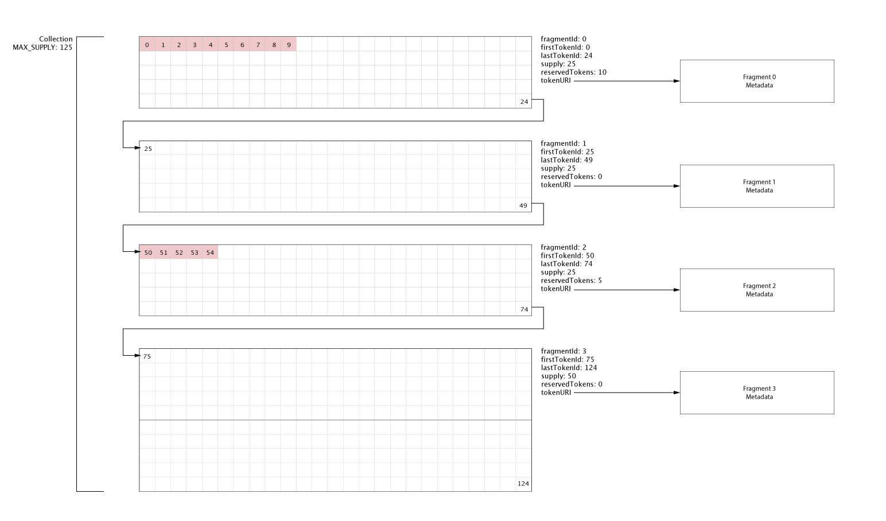

# ERC721Fragmentable Spec

## Overview

The system's architecture is predicated on the design of the `extensions/ERC721Fragmentable.sol` extension. The Fragmentable Extension was designed to allow a single collection to be partitioned into smaller sub-collections (hereafter referred to as `Fragments`). This collections-within-a-collection approach allows for a single NFT collection to be released in stages that are independent of one another, whilst maintaining their relationship with the collection as a whole. This means that, despite being released at different points in time, these "extensions" to the collection ensure they're managed by the same contract and appear in the same collection on secondary marketplaces. One potential use case could be that each fragment represents a new generation of the collection.



Let's use an NFT collection containing 125 tokens as a trivial example to explain the Fragmentable spec (illustrated above). Instead of all 125 tokens being minted in a single event (which might span hours or days), it can be split into a number of smaller fragments that can be released over weeks, months, or years. For this example, the first phase of the release might contain 25 tokens. This fragment will have its own supply (25), as well as define the range of its own token IDs (0 - 24). The diagram (above) indicates that token IDs 0-9 are reserved. This means that they are not available to the fragment's pool of public IDs and are reserved for special purposes (eg. the team or honorary characters for specific individuals).

Each fragment will have its own `baseURI` that's independent of the other fragments. The second fragment, perhaps also containing 25 tokens, would occupy the ID range of 25-49 and will again have its own `baseURI` pointing to the metadata location for that fragment only.

There is nothing in the spec that dictates that fragments be of any particular size. In our example, the final fragment is 2x the size of the preceding fragments. Provided the final fragment's `lastTokenId` does not exceed the Fragmentable collection's overall `supply`, the implementer is free to arrange the fragments as she sees fit.

## Fragment Design

Each fragment is defined by a `struct`:

```
    struct Fragment {
        uint8 status;
        uint8 locked;
        uint8 fragmentId;
        uint64 firstTokenId;
        uint64 supply;
        string baseURI;
        IRenderer renderer;
        TokenPool reservedTokens;
        TokenPool publicTokens;
    }
```

The `Fragment`'s member variables are responsible for the following:

- `status`: defines whether the Fragment has been initialized (created) and is used primarily when externally checking the properties of a Fragment.
- `locked`: A Fragment can be locked by an EOA with the `ADMIN` role. Locking a Fragment permanently freezes the metadata in its current state.
- `fragmentId`: A unique identifier for the Fragment, used for accessing the fragment in the `storage mapping` that keeps track of the created fragments.
- `firstTokenId`: defines the first token in the mapping's ID, ie the lower bounds of the fragments tokens
- `supply`: the number of tokens contained in the Fragment
- `baseURI`: The base URI that makes up the string returned by `tokenURI`, shared by each token in the Fragment
- `renderer`: The contract interface for the external on-chain renderer
- `reservedTokens`: The reserved Token Pool keeps track of the reserved token IDs in the collection.
- `publicTokens`: The public Token Pool keeps track of the publicly available token IDs which are randomly issued.

Each Fragment contains two Token Pools, represented by the `TokenPool` struct, which is responsible for keeping track of the tokenIDs that belong to the Fragment. If the collection owner decides they want to be able to assign specific token IDs to specific accounts, for example for marketing purposes or for team members, they would make use of the `reservedTokens` pool. The inheriting contract needs to ensure that tokens in the reserved range aren't minted by non-reserved accounts.

```
    struct TokenPool {
        uint64 issuedCount;
        uint64 startId;
        uint64 supply;
    }
```

By storing the `startId` and the `supply` we can compute the token IDs range, and thus can ensure that tokens outside of the pool are not minted. The `issuedCount` variable keeps track of the number of tokens in the pool that have been minted, and therefore what is available left to mint.

# Per-Fragment Metadata

Each Fragment is responsible for its own Metadata and has its own `baseURI`. Unless the Fragment has an on-chain render set (we'll cover this shortly), each Fragment can have an independent set of metadata, which allows fragments to be released independently of one another. This `baseURI` can be updated, should metadata need to be changed, or updated. However, in the spirit of non-fungible assets, once the owner is satisfied with the state of the metadata, this feature can be locked, permanently freezing the collection's metadata.

```js

/**
     * @notice  Allows the owner of the contract to update the metadata URI for a given fragment
     * @dev     A fragment's metadata can only be updated if the fragment has not been locked. Once the fragment
     *          has been locked, the metdata for that fragment is permananetly frozen.
     * @param   fragmentNumber  The fragment's position in the collection.
     * @param   uri  The content identifier for the fragment's metadata.
     */
    function updateFragmentMetadata(uint256 fragmentNumber, string memory baseURI_)
        external
        onlyRole(SYS_ADMIN_ROLE)
    {
        if (fragments[fragmentNumber].status == 0) revert FragmentInvalid();
        if (fragments[fragmentNumber].locked == 1) revert FragmentLocked();

        fragments[fragmentNumber].baseURI = baseURI_;
        emit FragmentMetadataUpdated(fragmentNumber, baseURI_);
    }

    /**
     * @notice  Allows the contract owner to lock a fragment's metadata, permanently freezing it.
     * @dev     This action is irreversible.
     * @param   fragmentNumber the fragment's identifier in the collection.
     */
    function lockFragmentMetadata(uint256 fragmentNumber) external onlyRole(SYS_ADMIN_ROLE) {
        if (fragments[fragmentNumber].status == 0) revert FragmentInvalid();
        fragments[fragmentNumber].locked = 1;
        emit FragmentMetadataLocked(fragmentNumber);
    }
```

The ultimate goal is to have the EXR ecosystem and its assets make use of on-chain metadata, which would allow users to upgrade and change their assets metadata in accordance with the game's gameplay mechanics. Because these features are not yet available, a provision has been made to allow for an on-chain renderer to be used via a contract interface in the future. This too can be locked, making the on-chain data immutable from a contract owner's standpoint.

```js
    function _fragmentTokenURI(uint256 fragment, uint256 tokenId)
        internal
        view
        returns (string memory)
    {
        if (fragments[fragment].status == 0) revert FragmentNotFound({fragment: fragment});

        if (fragments[fragment].renderer != IRenderer(address(0))) {
            return fragments[fragment].renderer.getTokenMetadata(tokenId);
        }

        return
            bytes(fragments[fragment].baseURI).length > 0
                ? string(abi.encodePacked(fragments[fragment].baseURI, "/", tokenId.toString()))
                : fallbackURI;
    }
```

If the Fragment has not been assigned a renderer, the contract returns the `tokenId` appended to the `baseURI`, provided it has been set, otherwise the `fallbackURI` is used - which is shared by all Fragments in the collection.

# Random Token Assignment

One of the features of the `ERC721Fragmentable` spec is the ability to issue randomized token IDs at mint time.

```
    function issueRandomId(
        uint256 fragment,
        bytes32 seed,
    ) internal returns (uint256) {
        Fragment storage currentFragment = fragments[fragment];

        uint256 remaining = currentFragment.publicTokens.supply -
            currentFragment.publicTokens.issuedCount;
        if (remaining == 0) revert TokenPoolEmpty();

        // returns a random number between 0 and the number of tokens remaining - 1, this will be
        // used as the random ID if the slot in the matrix corresponding to the index is empty
        uint256 randomIndex = uint256(
            keccak256(abi.encodePacked(recipient, blockhash(block.number - 1), seed))
        ) % remaining;

        // If the matrix is empty at the given random index (slot), we use the index as the token ID.
        // However, if the slot contains an ID, we'll assign that instead.

        uint256 offset = fragmentPoolTokenMatrix[fragment][randomIndex] == 0
            ? randomIndex
            : fragmentPoolTokenMatrix[fragment][randomIndex];

        currentFragment.publicTokens.issuedCount++;

        uint256 temp = fragmentPoolTokenMatrix[fragment][remaining - 1];

        if (temp == 0) {
            fragmentPoolTokenMatrix[fragment][randomIndex] = remaining - 1;
        } else {
            fragmentPoolTokenMatrix[fragment][randomIndex] = temp;
            delete fragmentPoolTokenMatrix[fragment][remaining - 1]; // small gas refund
        }

        uint256 tokenId = currentFragment.publicTokens.startId + offset;
        return tokenId;
    }

```

Each fragment has a `fragmentPoolTokenMatrix`, that keeps track of the issued token IDs. The `tokenId` that's returned is offset from the fragment's first public token ID, which ensures none of the reserved IDs ever get minted.
