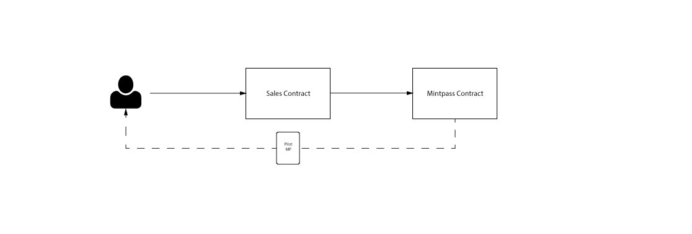
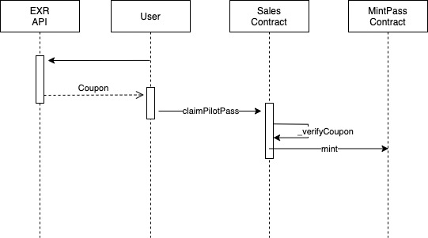
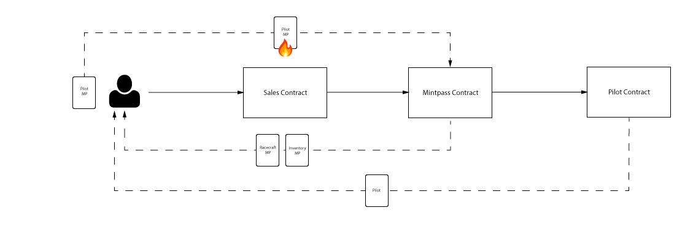
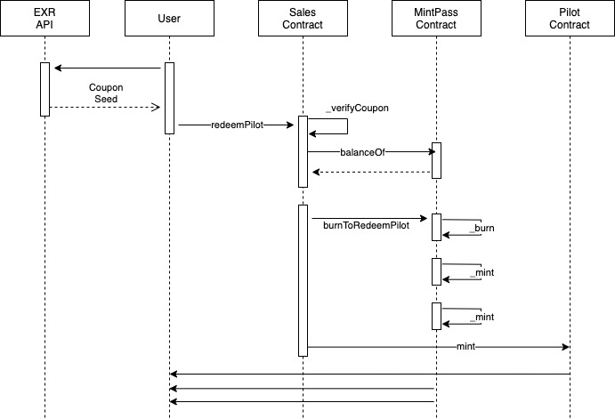
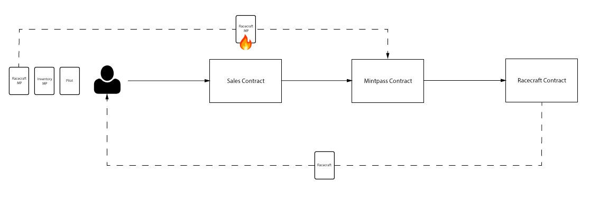
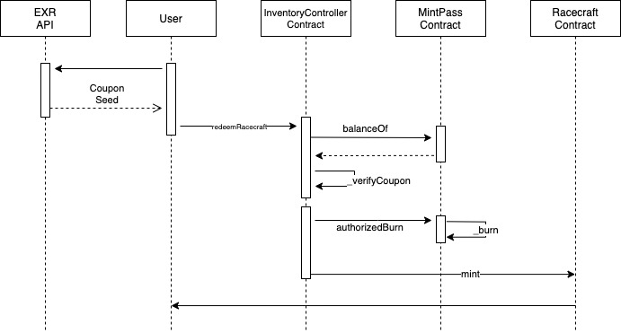
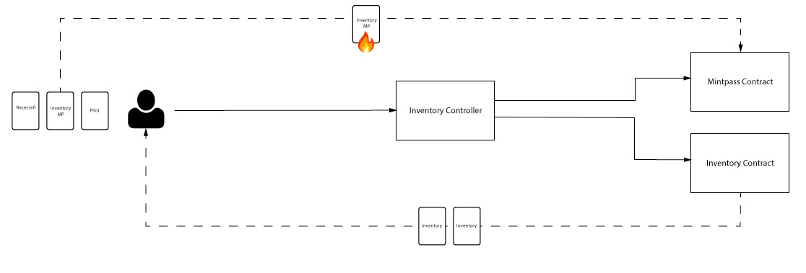
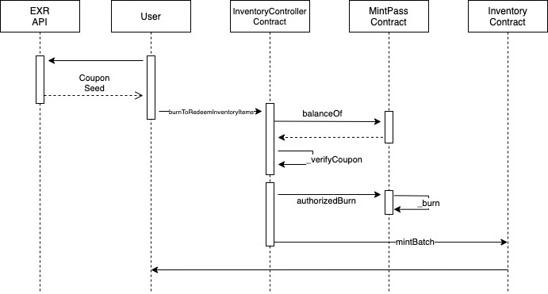

# User Contract Interactions

During the extended launch event, end-users will interact with the smart contract ecosystem a total of four times (we exclude the launch of the actual game from this). Each phase of the launch is described in detail below, but in summary:

- `Phase 1`: Whitelisted users claims a Pilot Mintpass token

- `Phase 2`: Pilot Mintpass holders exchange their Pilot Mintpass token for a Pilot NFT by burning it, and in the process receive additional Racecraft Mintpass and Inventory Mintpass tokens.

- `Phase 3`: Users burn their Racecraft Mintpass token in exchange for a Racecraft NFT.

- `Phase 4`: Users burn their Inventory Mintpass in exchange for two Inventory Item NFTs.

- `Phase 5`: The user contains all the necessary game items (Pilot, Racecraft & Inventory Items) to participate in the game's launch.

# Phase 1

Users claim a Pilot Mintpass token by calling `claimPilotPass`. There is no "public sale" event, instead every recipient of Pilot Mintpass is whitelisted. Users will have a predetermined amount of time to claim their Pilot Pass before the Pilot Claim event begins. If the user is whitelisted, the API will provide them with a signed `Coupon` and the data required for the claim.

High-Level Flow:

1. Caller fetches a `Coupon` from the EXR API.
1. Sales Contract computes the amount owed by the caller.
1. Sales contract checks that the supply is not being exceeded
1. Sales contract checks that the caller has not exceeded her allotted number of claims.
1. Sales Contract verifies the `Coupon`.
1. Mintpass contract increments the token claim count.
1. Sales Contract calls ` mintPassContract.mint(caller, qty, pilotPassTokenId, dedicatedFragment)` via the Mintpass contract interface.
1. Mintpass Contract calls `_mint`.
1. Mintpass Contract emits `PassMinted` event.
1. Sales Contract emits `MintPassClaimed` event.
1. If the `amountOwed` is less than the amount `paid`, Sales Contract calls `refundCaller` and refunds the caller the difference.

`claimPilotPass` will revert under the following conditions:

- the `state.claimPilotPass` is `0`.
- the fragment does not exist
- `pilotPassMaxSupply` is `0`, meaning the Fragment has not been created for the `EXRSalesContract`.
- The number of mints + the `qty` request by the caller exceeds `pilotPassMaxSupply`.
- `msg.value` is less than the amount required.
- the caller attempts to claim a `qty` greater than their `allotted` claims.
- the `Coupon` submitted by the caller is invalid.
- the `qty` requested by the caller is `0`.

# Phase 2

Users burn their Pilot Mintpass in exchange for a Pilot NFT by calling `redeemPilot` on the `EXRSalesContract`. As a byproduct of the burn process, the user receives an additional Racecraft Mintpass and an Inventory Mintpass. In place of an onchain random number generator (RNG) such as Chainlink's VRF, the caller fetches a randomized seed generated offchain and encoded in a `Coupon`.

High-Level Flow:

1. Caller fetches a `Coupon` from the EXR API.
1. Sales Contract checks the caller's Pilot Mintpass balance via the Mintpass Contract interface.
1. Sales Contract verifies the authenticity of the Coupon containing the `seed`.
1. Sales Contract calls `burnToRedeemPilot` via the `Mintpass Contract` interface.
1. Mintpass Contract increments the burn count for `tokenBurnCounts[pilotPassTokenId]`
1. Mintpass Contract increments the count for Racecraft Mintpass `tokenMintCountsByFragment[fragment][racecraftPassTokenId]`
1. Mintpass Contract increments the count for Inventory Mintpass `tokenMintCountsByFragment[fragment][inventoryTokenId]`
1. Mintpass Contract burns the caller's Pilot Mintpass
1. Mintpass Contract emits `PassBurned` event
1. Mintpass Contract mints a Racecraft Mintpass token to the caller's account
1. Mintpass Contract emits the `PassMinted` event
1. MintPass Contract mints an Inventory Mintpass token to the caller's account
1. Mintpass Contract emits the `PassMinted` address
1. Mintpass Contract emits the `PilotRedeemed` event
1. Sales Contract emits the `MintPassBurned` event
1. Sales Contract calls the `mint` function via the `pilotContract` interface.
1. Pilot Contract loads the fragment into memory
1. For each token that gets minted, a random token ID is generated by the Sales Contract.
1. For each token that gets minted, the ID is stored along with the corresponding Fragment ID.
1. For each token that gets minted the `GameAssetMinted` event is emitted

`redeemPilot` reverts under the following conditions:

- Redeem pilot state is not active, meaning `state.redeemPilot` is equal to `0`
- `pilotPassMaxSupply` is set to `0`
- The caller's balance of Mintpass Tokens is `0`
- The `Coupon` supplied by the caller is invalid

# Phase 3

Users burn their Racecraft Mintpass in exchange for a Racecraft NFT by calling `redeemRacecraft`.

High-Level Flow:

1. Caller fetches a `Coupon` from the EXR API.
1. Sales Contract checks the caller's Racecraft Mintpass balance via the Mintpass Contract interface.
1. Sales Contract verifies the authenticity of the Coupon containing the random `seed`.
1. Sales Contract calls `authorizedBurn` via the `Mintpass Contract` interface.
1. Mintpass Contract increments the burn count by `tokenBurnCounts[tokenId]`
1. Sales Contract calls `mint` via the `Racecraft Contract`.
1. Mintpass Contract burns the Racecraft Mintpass Token
1. Mintpass Contract emits `PassBurned` event
1. Sales Contract mints the Racecraft Token via the `Racecraft` interface

`redeemRacecraft` reverts under the following conditions:

- The `state.redeemRacecraft` is equal to `0`.
- The `racecraftPassMaxSupply` is equal to `0`, meaning the Fragment has not been created.
- The the Caller's balance of the Racecraft Mintpass is equal to `0`
- The `Coupon` supplied by the caller is invalid

# Phase 4

Users burn their Inventory Item Pass in exchange for 2x Inventory Item NFTs by calling `burnToRedeemInventoryItems` on the Sales Contract.

High-Level Flow:

1. Caller fetches a `Coupon` from the EXR API.
1. EXRInventoryController Contract checks the balance of the caller's Inventory Mint Pass
1. EXRInventoryController Contract validates the `Coupon`
1. EXRInventoryController Contract calls `authorizedBurn` via the MintPass interface.
1. EXRInventoryController Contract creates `ids` array in memory of a length equal to the number of items to mint
1. EXRInventoryController Contract creates `amounts` array in memory of a length equal to the number of items to mint
1. EXRInventoryController Contract calls the internal `claimRandomItems` function.
1. For each token to be minted, a random number is generated using the caller's `address`, `block.number-1`, the `seed`, and the `index` in the loop
1. For each token to be minted, EXRInventoryController Contract selects a token ID based on the number that was generated and adds it to the `ids` array.
1. EXRInventoryController Contract calls `mintBatch` via the `inventoryContract` interface.
1. InventoryContract calls the `mintBatch` function.

# Phase 5

The user now holds a Pilot, Racecraft and 2x Inventory Item NFTs. They now hold all the necessary game items to participate in beta version of the Exiled Racers game.

